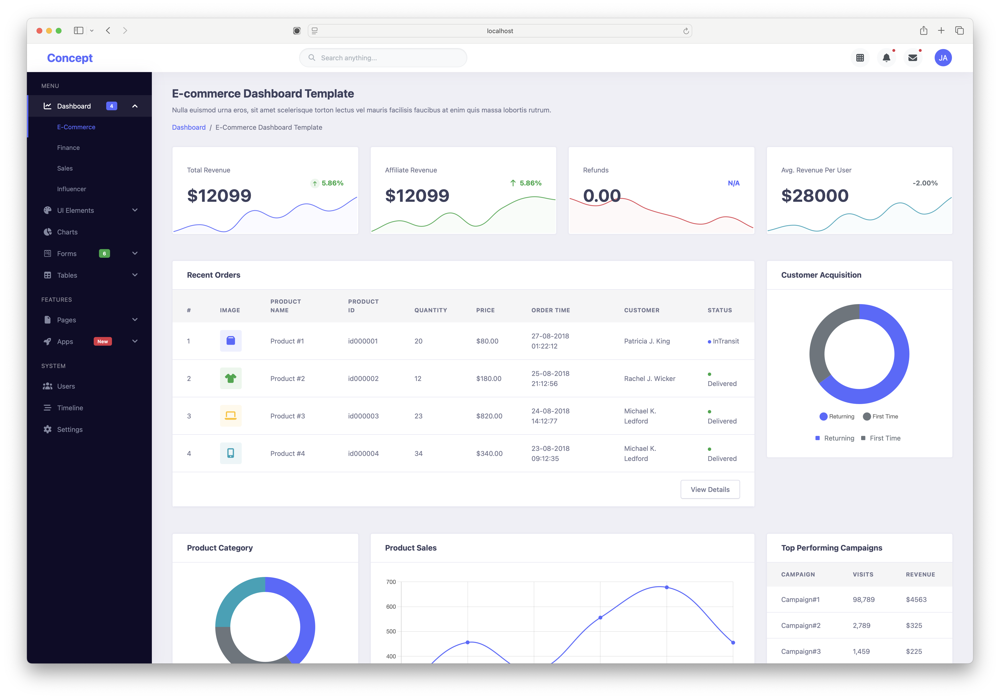

# Dashboard Overview

Concept includes multiple dashboard variants, each designed for specific use cases. All dashboards are fully responsive and built with Bootstrap 5.

## Finance Dashboard



The Finance Dashboard provides a comprehensive view of financial metrics:

### Key Features:
- **Revenue Cards** with sparkline charts showing trends
- **Income vs Expenses** comparison chart
- **Monthly performance** tracking
- **Recent transactions** table
- **Financial goals** progress tracking

### Metrics Displayed:
- Total Income with percentage change
- Total Expenses with trend indicators
- Cash on Hand
- Net Profit margins

### Use Cases:
- Financial reporting applications
- Accounting software dashboards
- Budget management tools
- Business analytics platforms

## Sales Dashboard

The Sales Dashboard focuses on sales performance and team metrics:

### Key Features:
- **Sales funnel** visualization
- **Revenue by product** breakdown
- **Sales team performance** leaderboard
- **Geographic sales distribution**
- **Recent orders** with status tracking

### Metrics Displayed:
- Total Sales Volume
- Conversion Rates
- Average Order Value
- Sales by Region

## E-commerce Dashboard

The main E-commerce Dashboard provides store management insights:

### Key Features:
- **Revenue metrics** with period comparisons
- **Product performance** charts
- **Customer analytics**
- **Order status** overview
- **Top selling products** list

### Metrics Displayed:
- Total Revenue
- Number of Orders
- Customer Acquisition
- Cart Abandonment Rate

## Influencer Dashboard

Designed for social media management and influencer tracking:

### Key Features:
- **Social media metrics** across platforms
- **Engagement rate** tracking
- **Follower growth** charts
- **Content performance** analytics
- **Campaign ROI** measurement

### Metrics Displayed:
- Total Followers
- Engagement Rate
- Reach and Impressions
- Content Performance

## Dashboard Components

All dashboards share common components:

### 1. Metric Cards
```html
<div class="card finance-metric-card">
  <h5 class="card-header">Total Income</h5>
  <div class="card-body">
    <div class="metric-value d-inline-block">
      <h1 class="mb-1">$5,79,000</h1>
    </div>
    <div class="metric-label d-inline-block float-end text-success fw-bold">
      <span class="icon-circle-small icon-box-xs text-success bg-success-light">
        <i class="fa fa-fw fa-arrow-up"></i>
      </span>
      <span class="ms-1">25%</span>
    </div>
  </div>
</div>
```

### 2. Chart Integration
All dashboards use Chart.js for data visualization:
- Line charts for trends
- Bar charts for comparisons
- Doughnut charts for distributions
- Area charts for cumulative data

### 3. Data Tables
Interactive tables with:
- Sorting capabilities
- Search functionality
- Pagination
- Export options

## Customization

Each dashboard can be customized:

### Color Schemes
Dashboards use Concept's color palette:
- Primary: `#5969ff`
- Success: `#28a745`
- Danger: `#dc3545`
- Warning: `#ffc107`

### Layout Options
- **Full-width** or **boxed** layout
- **Fixed** or **scrollable** sidebar
- **Light** or **dark** theme variations

### Widget Configuration
All dashboard widgets can be:
- Rearranged using drag-and-drop
- Resized to fit your needs
- Hidden/shown based on user preferences
- Configured with custom data sources

## Responsive Design

All dashboards are fully responsive:

### Desktop (1200px+)
- Full sidebar navigation
- Multiple columns for widgets
- Expanded data tables
- Detailed charts with legends

### Tablet (768px - 1199px)
- Collapsible sidebar
- 2-column widget layout
- Simplified charts
- Responsive tables

### Mobile (< 768px)
- Hamburger menu navigation
- Single column layout
- Touch-optimized controls
- Swipeable charts

## Performance

Dashboards are optimized for performance:
- Lazy loading of chart data
- Efficient DOM updates
- Minimized reflows
- Cached API responses
- Progressive enhancement

## Getting Started

To use a dashboard:

1. Choose the appropriate dashboard variant
2. Configure your data sources
3. Customize the appearance
4. Deploy to your server

Each dashboard includes sample data to help you get started quickly.